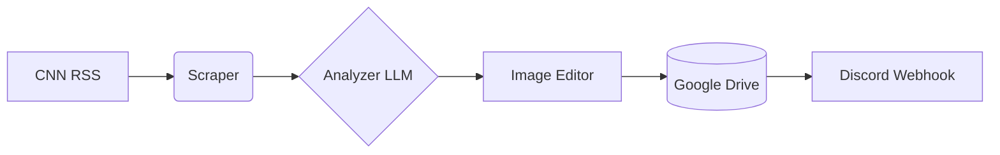

# Facebook Viral News Image Agent


An automated, cloud-based Python agent that monitors CNN Entertainment for the latest Hollywood trends, uses an advanced LLM to generate viral-style copy, designs a Facebook poster, uploads it to Facebook directly, and notifies you via Discord.

## Features
- **24x7 Automation**: Runs exactly 6 times a day (US EST) using GitHub Actions.
- **Smart News Selection**: Automatically skips duplicates and only picks the most trending news.
- **AI Copywriting**: Integrates NVIDIA Nemotron LLM to generate click-worthy headlines and viral hooks in American English.
- **Dynamic Image Editing**: Automatically downloads featured images, applies dark gradient overlays, adds drop-shadow typography, highlights key words in yellow, and brands the image with your logo.
- **Cloud Storage**: Instantly uploads the final image to Google Drive and sets public access permissions.
- **Instant Notifications**: Sends an automated Discord message with the Facebook post details right after generation.

## System Architecture


## Folder Structure
```
project-root/
├── .github/
│   └── workflows/      # GitHub Actions cron scheduler
├── assets/
│   ├── logo/           # Branding logo files
│   └── templates/      # Fonts and design assets
├── output/             # Processed state tracking
├── src/
│   ├── analyzer/       # LLM Integration
│   ├── image_editor/   # Poster Generation (Pillow)
│   ├── scraper/        # RSS Parsing
│   ├── storage/        # Google Drive Integration
│   └── discord/        # Discord Notifications
├── .env.example
├── main.py
└── README.md
```

## Installation Guide

If you want to run this locally:
1. Clone the repository.
2. Create a virtual environment: `python3 -m venv venv`
3. Activate it: `source venv/bin/activate`
4. Install dependencies: `pip install -r requirements.txt`

## Configuration Guide

This project requires several environment variables to function correctly. Rename `.env.example` to `.env` and fill in the details:

```env
DISCORD_WEBHOOK_URL="your_discord_webhook_url"
GOOGLE_DRIVE_FOLDER_ID="your_google_drive_folder_id"
GOOGLE_APPLICATION_CREDENTIALS="service_account.json"
NVIDIA_API_KEY="your_nvidia_api_key"
BRANDING_TEXT="Celebrity Buzz USA"
```

## GitHub Actions Setup

The entire workflow runs seamlessly on GitHub Actions. To set this up in your own fork:

1. Go to your GitHub Repository -> **Settings** -> **Secrets and variables** -> **Actions**.
2. Add the following **Repository Secrets**:
   - `DISCORD_WEBHOOK_URL`: Your Discord Webhook URL for reports.
   - `GOOGLE_DRIVE_FOLDER_ID`: The Folder ID from your Google Drive URL.
   - `GOOGLE_CREDENTIALS_JSON`: Paste the ENTIRE content of your `service_account.json` file here.
   - `NVIDIA_API_KEY`: Your Nvidia Nemotron API key.
3. The GitHub Action will automatically reconstruct the `service_account.json` securely during runtime and execute the bot on the defined schedule.

## Usage Instructions

Once the repository is pushed and secrets are configured:
- **Automated Mode**: The bot will run automatically at 7 AM, 10 AM, 1 PM, 4 PM, 7 PM, and 10 PM US Eastern Time.
- **Manual Trigger**: You can trigger a run instantly by going to the **Actions** tab in GitHub, clicking "Facebook Viral News Agent", and clicking **Run workflow**.

## Troubleshooting

- **No Discord Messages**: Ensure your `DISCORD_WEBHOOK_URL` is correct.
- **Drive Upload Failed**: Ensure the `service_account.json` belongs to an account that has Editor access to the specific Google Drive folder.

## License Information
This project is private and tailored for automated Facebook page management.
